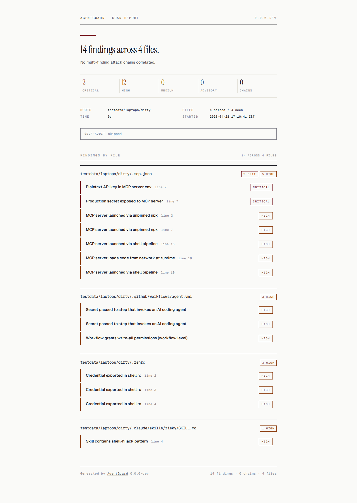

# Audr

**Developer-machine security scanner for AI-agent/tooling risk.**

Scan MCP servers, Claude Code skills, Cursor / Codex / Windsurf configs,
agent instruction docs, GitHub Actions workflows, package manifests, and local
secret exposure for developer-machine risk. Offline by default. Single static
Go binary, no `npm`/`pip`. Emits HTML, SARIF, and JSON reports.

```
==> Permission-loose agent + reachable secret = exfil chain.
    5 attack chains, 48 findings across 36 files.

Attack chains (5):
  - [CRITICAL] Permission-loose agent + reachable secret = exfil chain
    Attacker gets: One prompt injection reads SSH keys, .env files,
                   and plaintext API keys without prompting
  - [CRITICAL] Codex: trusted $HOME + plaintext key = no-friction takeover
  - [CRITICAL] Cloning a malicious repo can RCE this dev box
  - [HIGH]     Third-party plugin ships an unauthenticated MCP server
  - [HIGH]     Same credential `CONTEXT7_API_KEY` reused across 2 harnesses

Report: /tmp/audr-scan.html
```

The HTML report renders as a forensic document — file by file, severity by
severity, with a per-finding "what an attacker gets" callout. Hand it to a
security reviewer and they read it like a court exhibit, not a scanner dump.



> Stdout summary above is from a real `$HOME` scan. Screenshot is the
> corresponding HTML report from `testdata/laptops/dirty`. Live sample:
> [`docs/sample-report.html`](docs/sample-report.html) — no external requests,
> fonts embedded.

---

## Why

Your team installed Claude Code, Cursor, Codex, three MCP servers, and a
couple of skills last week. Some of those configs let an attacker:

- read your `.env`, SSH keys, and shell history through a single prompt
  injection that triggers an over-permissioned agent;
- run shell commands on your laptop the moment you `git clone` a repo,
  because somebody committed a `.claude/settings.json` with a hook
  ([CVE-2025-59536](https://nvd.nist.gov/vuln/detail/CVE-2025-59536));
- exfiltrate a production credential through a CI step that hands
  `secrets.DEPLOY_TOKEN` to an autonomous agent.

Audr finds these in 1 second per dev box, or in CI on every PR. It
reads the same config files Claude / Cursor / Codex / Windsurf actually load
(`~/.claude/`, `~/.cursor/`, `~/.codex/config.toml`, `.mcp.json`,
`.claude/skills/**`, `.github/workflows/*.yml`, `~/.zshrc`), scans
package manifests, optionally runs OSV-Scanner for dependency vulnerabilities,
optionally runs TruffleHog for secret exposure, runs built-in rules plus
attack-chain correlations, and emits HTML for humans, SARIF for GitHub Code
Scanning, JSON for everything else.

Audr is not trying to rebuild every specialist scanner. It owns the single
local/CI command and the unified developer-machine report. For broad dependency
vulnerability coverage, `audr scan` can call OSV-Scanner (Apache-2.0). For deep
secret exposure, `audr scan --secrets` or `audr scan --deep` can call
TruffleHog. If a scanner is missing and Audr is running interactively, it prints
the exact install command and asks before installing anything. In CI or
machine-output mode, Audr never prompts; use `audr doctor` for setup guidance,
`audr update-scanners` to refresh scanner binaries, `--require-deps` to fail
when OSV-Scanner is unavailable, or `--require-secrets` to fail when TruffleHog
is unavailable.

Audr delegates broad dependency vulnerability coverage to OSV-Scanner instead
of maintaining its own package CVE database, and delegates deep secret discovery
to TruffleHog instead of duplicating hundreds of provider-specific detectors.
Dependency results appear in the Package vulnerabilities section; TruffleHog
results appear in the Secrets section with raw values redacted. If OSV-Scanner
is unavailable or fails, the HTML/JSON/text report now includes a visible
coverage warning and labels the result as incomplete instead of clean; use
`audr scan --ci --require-deps .` when CI must fail rather than emit a partial
package-vulnerability report.

For active npm supply-chain campaigns such as Mini Shai-Hulud, Audr uses
OSV-Scanner to surface known malicious package versions from manifests and
lockfiles, then layers Audr-native checks for local compromise indicators OSV
cannot see: Claude Code `SessionStart` persistence hooks, VS Code folder-open
persistence tasks, GitHub Actions workflows that serialize `toJSON(secrets)`,
`gh-token-monitor` services/LaunchAgents, and known dropped payload filenames.

---

## Install

```sh
# macOS + Linux:
curl -fsSL https://raw.githubusercontent.com/harshmaur/audr/main/install.sh | sh
```

```powershell
# Windows (PowerShell):
iwr https://raw.githubusercontent.com/harshmaur/audr/main/install.ps1 -UseBasicParsing | iex
```

The scripts download the latest signed release artifact from GitHub Releases,
verify the SHA-256 against the published `SHA256SUMS`, then install the
binary. On macOS + Linux the installer also verifies the cosign signature
against the sigstore transparency log when `cosign` is on PATH. The Linux /
macOS binary lands at `~/.local/bin/audr`; the Windows binary at
`%LOCALAPPDATA%\audr\audr.exe`.

### About the Windows SmartScreen warning

v1.1 Windows binaries are **not Authenticode-signed.** The first time you
run `audr.exe`, Windows may show "Windows protected your PC — unknown
publisher". Click `More info → Run anyway`. The installer also
`Unblock-File`s the binary so subsequent runs are silent.

The trust anchor for the Windows install path is the **cosign-signed
SHA-256** hash the installer verifies against the published `SHA256SUMS`
file — not an Authenticode certificate. Verify the hash; the binary is
what it claims to be.

An Authenticode-signed Windows build is on the roadmap (see `TODOS.md`
item 5). It depends on design-partner demand justifying the EV cert
spend. In the meantime CISO security teams running their own diligence
can verify against the cosign transparency log per the
[Verify before installing](#verify-before-installing) section.

**Build from source:**

```sh
git clone https://github.com/harshmaur/audr
cd audr
go build -o audr ./cmd/audr
./audr version
```

---

## Run

```sh
# Scan your machine ($HOME). Writes HTML to /tmp/, opens in your browser,
# prints a forensic summary on stdout.
audr scan

# Scan a specific tree.
audr scan ~/code/my-repo

# Output formats.
audr scan -f sarif -o scan.sarif    # GitHub Code Scanning compatible
audr scan -f html  -o scan.html     # forensic-document HTML report
audr scan -f json  -o -  | jq       # pipe JSON to stdout

# External scanners.
audr doctor                         # check OSV-Scanner + TruffleHog availability
audr update-scanners                # dry-run: print scanner update commands
audr update-scanners --yes          # update OSV-Scanner + TruffleHog binaries
audr update-scanners --db-only      # dry-run: no-op for OSV-Scanner; no local DB cache
audr scan --no-deps .               # Audr-native checks only
audr scan --deps-only .             # OSV dependency vulnerability scan only
audr scan --ci --require-deps .     # CI: no prompts; fail if OSV-Scanner is missing
audr scan --secrets .               # include TruffleHog secret scanning
audr scan --secrets-only .          # TruffleHog secret scan only
audr scan --deep .                  # include deeper checks such as TruffleHog
audr scan --ci --require-secrets .  # CI: fail if TruffleHog is missing/fails

# Suppress findings (per-rule or per-path globs).
echo 'mcp-unpinned-npx **/old-mcp.json' > .audrignore
audr scan
```

Exit code is `1` if any high or critical finding fires, else `0`. CI usage:

```yaml
- run: audr scan -f sarif -o audr.sarif .
- uses: github/codeql-action/upload-sarif@v3
  with: { sarif_file: audr.sarif }
```

---

## Attack Chains

After the per-rule pass, Audr runs a correlation pass that fires
when specific findings co-occur. Each chain combines findings into an
end-to-end attacker walkthrough — what they touch, in what order, and what
they walk away with:

| Chain | Severity | Triggers |
|---|---|---|
| Cloning a malicious repo can RCE this dev box | Critical | hook RCE in repo-shipped `.claude/settings.json` |
| Permission-loose agent + reachable secret = exfil chain | Critical | consent-bypass / broad allowlist + readable secrets |
| Codex: trusted `$HOME` + plaintext key = no-friction takeover | Critical | trust=trusted on broad path + plaintext key in same file |
| Third-party plugin ships an unauthenticated MCP server | High | enabled plugin + bundled `.mcp.json` with no auth |
| Same credential reused across N harnesses | High | same env-var name in 2+ harness configs |

Each chain renders in HTML with a forensic-style "Attacker gets:" call-out
and full prose walkthrough; the same outcome line shows on stdout.

---

## What it scans

| Path | Format | What gets parsed |
|---|---|---|
| `~/.claude/`, `.claude/`, `.mcp.json` | Claude Code (JSON) | hooks, statusLine, permissions allowlist, MCP servers, enabledPlugins, marketplaces |
| `~/.codex/config.toml`, `.codex/config.toml` | Codex CLI (TOML) | approval_policy, sandbox_mode, trust_level, MCP servers, http_headers |
| `~/.cursor/`, `.cursor/` | Cursor (JSON) | mcpAllowlist, terminalAllowlist, MCP wildcards |
| `~/.codeium/windsurf/mcp_config.json` | Windsurf (JSON) | MCP servers, alwaysAllow, headers |
| `**/.claude/skills/**/*.md` | Skill (Markdown + frontmatter) | shell-hijack patterns, undeclared dangerous tools |
| `.github/workflows/*.yml` | GitHub Actions | `permissions: write-all`, secrets exposed to agent steps |
| `~/.bashrc`, `~/.zshrc`, `~/.profile`, `~/.zprofile` | Shell rc | exported credentials |
| `Microsoft.PowerShell_profile.ps1`, `profile.ps1`, PSReadLine `ConsoleHost_history.txt` | PowerShell profile (Windows) | `iwr | iex` RCE pattern, credential env vars, ExecutionPolicy bypass |

Cursor, Codex, and Windsurf MCP configs share a normalized model — adding
the next harness costs one parser, zero new rules.

Always-skipped directories (defensive default): `node_modules`, `vendor`,
`.git`, `dist`, `build`, `target`, `__pycache__`, `.next`, `.cache`,
plus Windows-specific cache trees: `INetCache`, `WindowsApps`, `NuGet`,
`.nuget`, `npm-cache`, `go-build`.

---

## Ruleset

**Claude Code (5)**
- `claude-hook-shell-rce` — Critical — hook / statusLine / shell-shaped fields run shell commands (CVE-2025-59536)
- `claude-skip-permission-prompt` — Critical — `skipAutoPermissionPrompt` / `skipDangerousModePermissionPrompt` removes consent gate
- `claude-mcp-auto-approve` — High — MCP server marked auto-approve
- `claude-bash-allowlist-too-broad` — High — `permissions.allow` permits dangerous-verb arg-wildcards
- `claude-third-party-plugin-enabled` — Medium / Advisory — plugin from non-Anthropic marketplace

**Codex CLI (2)**
- `codex-approval-disabled` — Critical — `approval_policy = "never"`
- `codex-trust-home-or-broad` — Critical — `trust_level = "trusted"` on `$HOME` or broader

**Cursor (2)**
- `cursor-allowlist-too-broad` — Critical — terminal allowlist with dangerous-verb arg-wildcards
- `cursor-mcp-wildcard` — High — MCP wildcard match

**MCP — generalized across Cursor / Codex / Windsurf (3)**
- `mcp-plaintext-api-key` — Critical — plaintext credential in MCP server config
- `mcp-unpinned-npx` — High — unpinned `npx ... @latest` MCP server
- `mcp-unauth-remote-url` — High — remote MCP URL without auth header

**MCP supplemental (3)**
- `mcp-prod-secret-env` — Critical — production-shape secret in env block
- `mcp-shell-pipeline-command` — High — shell pipeline as command
- `mcp-dynamic-config-injection` — High — config field interpolated from env / argv

**Skill / instruction-doc (2)**
- `skill-shell-hijack` — High — `curl|bash`, `eval`, base64-decode pattern in skill body
- `skill-undeclared-dangerous-tool` — Medium — skill uses Bash/Edit/Write but doesn't declare in frontmatter

**GitHub Actions (2)**
- `gha-write-all-permissions` — High — `permissions: write-all` at workflow or job scope
- `gha-secrets-in-agent-step` — High — secret passed to a step that invokes a coding agent

**Shell rc (1)**
- `shellrc-secret-export` — High — exported credential matching a known token shape

**Total: 20 rules, 4 format families, 5 attack chains.** Every finding
carries a `taxonomy` label, so you know exactly what Audr can and
cannot do for you:

- **enforced** — a failed scan can fail CI or block a commit. Audr
  prevents the violation from reaching production.
- **detectable** — reliably found, but a workflow (review / alert /
  education) has to act on it. Audr tells you; it does not stop you.
- **advisory** — cannot be reliably detected from config alone. Documented
  as best practice so it is not silently missing.

---

## Verify before installing

A security tool you install from the internet is itself part of your supply
chain. Treat it that way. Every release artifact ships with the evidence
needed to verify it before it runs on your laptop or in your CI:

- **Source on GitHub.** Every rule, parser, and output formatter is
  inspectable. Read the code before installing.
- **Signed releases via cosign.** Every release artifact has a detached
  `.sig` and `.crt` on the GitHub Release page.
- **SLSA L2 build provenance** (v0.2.4+). Build attestations via
  `actions/attest-build-provenance`. Verify with `gh attestation verify`.
- **Reproducible builds.** Built with `-trimpath -buildvcs=false` and a
  pinned Go toolchain.
- **SBOM published.** SPDX + CycloneDX, every release.
- **Zero telemetry.** Runs entirely offline; the rendered HTML report
  embeds its fonts as base64 data URIs and makes zero external requests.

Two subcommands implement the verification path so you don't need cosign
on a fresh machine to get most of the benefit:

```sh
# Verify a downloaded release tarball against SHA256SUMS (and against the
# sigstore transparency log if cosign is on PATH).
audr verify audr-v0.2.4-linux-arm64.tar.gz

# Print the SHA-256 of the running binary, plus every rule and chain it
# will fire. Diff this between two installs to confirm they are identical.
audr self-audit
audr self-audit --json | jq .binary.sha256
```

### Manual verify (CISO security-team workflow)

```sh
VERSION=v0.2.4
ARCH=darwin-arm64   # or linux-amd64, linux-arm64, darwin-amd64
BASE="https://github.com/harshmaur/audr/releases/download/${VERSION}"

curl -fsSL -O "${BASE}/audr-${VERSION}-${ARCH}.tar.gz"
curl -fsSL -O "${BASE}/audr-${VERSION}-${ARCH}.tar.gz.sig"
curl -fsSL -O "${BASE}/audr-${VERSION}-${ARCH}.tar.gz.crt"
curl -fsSL -O "${BASE}/SHA256SUMS"

# 1) SHA-256 matches the published sums file
shasum -a 256 -c SHA256SUMS --ignore-missing

# 2) cosign verifies against sigstore transparency log
cosign verify-blob \
  --certificate "audr-${VERSION}-${ARCH}.tar.gz.crt" \
  --signature   "audr-${VERSION}-${ARCH}.tar.gz.sig" \
  --certificate-identity-regexp 'https://github.com/harshmaur/audr/.+' \
  --certificate-oidc-issuer 'https://token.actions.githubusercontent.com' \
  "audr-${VERSION}-${ARCH}.tar.gz"

# 3) SLSA L2 build provenance (v0.2.4+)
gh attestation verify "audr-${VERSION}-${ARCH}.tar.gz" \
  --repo harshmaur/audr

# 4) (belt-and-suspenders) build from source and compare hashes
git clone --depth 1 --branch "${VERSION}" https://github.com/harshmaur/audr
cd audr
CGO_ENABLED=0 go build -trimpath -buildvcs=false \
  -ldflags="-s -w -X main.Version=${VERSION}" \
  -o audr ./cmd/audr
shasum -a 256 audr
```

---

## Suppression

```
# rule-id alone disables a rule globally
mcp-unpinned-npx

# path glob alone suppresses ALL rules under that path
testdata/**

# rule-id + glob disables a rule under a path
gha-write-all-permissions .github/workflows/release.yml
```

Inline `# audr:disable=rule-id` is on the v0.3 list.

---

## Roadmap

- **v0.4 (shipped):** always-on daemon, live local dashboard, hybrid
  watch+poll engine, OS-package CVE detection, AI chat-transcript secret
  scanning, OS-native toast notifications.
- **v0.5 (shipped):** click-to-open notifications on Linux, user-controllable
  scanner toggles, SQLite migration framework, sidecar lowprio (CPU + IO),
  sidecar PATH augmentation, runtime-info detection.
- **v0.6 / v1.1 (this release):** Windows support end-to-end (scanner walker,
  daemon install via Scheduled Task at user logon, lowprio with
  IoPriorityHintLow, PowerShell profile parser + 3 PowerShell-specific rules,
  Windows scan-root coverage, notification preflight diagnostics), macOS
  click-to-open via `terminal-notifier`, cross-platform format detection.
- **v1.1.x (deferred from v1.1):** Windows click-to-open notifications via
  WinRT toast + AppUserModelID registration, Authenticode signing (depends
  on EV cert spend).
- **v0.7 / v1.2 (this release):** user-editable policy overlay
  (`~/.audr/policy.yaml`) with daemon hot-reload on every scan cycle.
  `audr policy show / path / edit / validate / init` CLI subcommands.
  Dashboard policy editor at `/policy/edit` with Form view, per-rule
  enable/disable + severity overrides + named allowlists + suppressions
  (each requires a reason). Canonical-generated YAML format with notes
  field for comment-preservation. Precedence model: enable check → scope
  filter → suppression union (policy.yaml + .audrignore) → severity
  override.
- **v1.2.x (deferred from v1.2):** CodeMirror 6 YAML editor with linting,
  htmx-based main-dashboard refactor, fsnotify watcher for live-reload,
  diff-preview modal with destructive-action confirm gate.
- **v1.3 (this release) — Loveable Daily Driver:** dedup engine. One row
  per unique vulnerability instead of one row per affected path. Each
  rolled-up row partitions affected paths into three fix-authority
  buckets: ① YOU CAN FIX (your projects — copy a paste-ready override
  snippet for npm / yarn / pnpm / bun / go / cargo), ② PLUGIN MAINTAINER
  FIXES (vendor-shipped plugin caches — click "File issue with <vendor>"
  for a pre-filled GitHub issue), ③ MARKETPLACE / UPSTREAM (track only).
  Same dashboard, same chrome, smarter rows.
- **v1.4 (planned):** AV-feel dashboard layer over v1.3 — default-green
  state, "Protected for N days" streak, health-score 0-100, single
  threat-banner card when a critical chain fires. Gated on v1.3 dogfood
  signal.
- **v1.5 (planned):** active quarantine. When a critical attack chain
  fires, daemon (opt-in) renames the offending config to
  `~/.audr/quarantined/<chain>/<timestamp>/` with one-click undo and
  a JSONL audit log. Lets audr truthfully say "audr blocked N attacks
  this week."
- **v1.3+ (other deferrals):** custom rule definitions (Semgrep-style
  YAML), BYOD privacy mode, GitHub Action template, more harness
  detectors (Cline / Continue / Roo / Aider / OpenClaw / Hermes /
  Goose), tool-description prompt-injection rules, inline
  `# audr:disable=` suppression syntax.

---

## License

[**FSL-1.1-MIT**](https://fsl.software/) — Functional Source License with MIT
future grant. The source is fully readable, you can run it inside your company
(internal use), modify it, and redistribute it. The one restriction is reselling
it as a competing commercial product or service. Two years after each release,
that release reverts to plain MIT.

Same model used by Sentry, Convex, GitButler, Keygen.

---

## Contributing

```sh
go build -o audr ./cmd/audr
go test -race -count=1 ./...

# Run against the dirty fixture
./audr scan -f html -o /tmp/r.html testdata/laptops/dirty
```

A new rule = a struct in `internal/rules/builtin/{format-family}.go`
implementing the `rules.Rule` interface, registered in the `builtins()`
slice. Every rule ships with three table-driven test cases (positive,
negative, edge).
